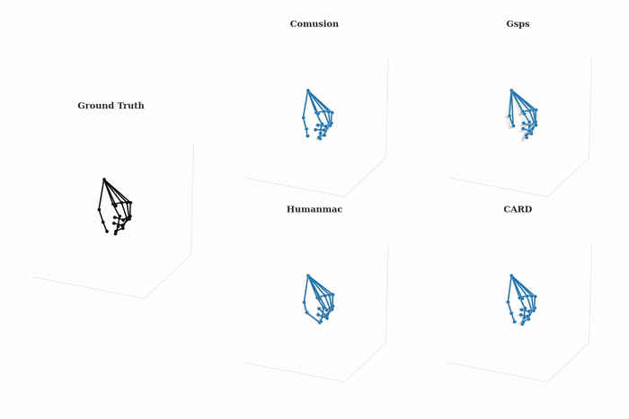

# CARD: Conditional Autoregressive Diffusion for Hand Motion Forecasting

Training and evaluation workspace for CARD, a diffusion-based hand-motion forecasting model, with reproducible experiment configs, ablation runners, and dataset-specific orchestration.



## Project Layout

- `configs/experiment.yaml`: main experiment configuration
- `configs/models/*.yaml`: per-model defaults
- `scripts/run_all_models.sh`: entrypoint script
- `tools/run_all_models.py`: orchestrator
- `results/all_models_metrics_long.csv`: aggregate metrics
- `vendor/`: model repositories used by the orchestrator

## Environment Setup

Use `uv` to create and manage the local virtual environment.

Create `.venv` and install dependencies:

```bash
cd /path/to/diffusion_hands
uv venv .venv
uv pip install -r requirements.txt
```

Activate it:

```bash
source .venv/bin/activate
```

## Running

Default run:

```bash
cd /path/to/diffusion_hands
bash scripts/run_all_models.sh
```

Run the card ablation config:

```bash
bash scripts/run_card_ablation.sh
```

Run a custom config:

```bash
bash scripts/run_all_models.sh configs/experiment.yaml
```

The repository currently includes these launcher scripts only:

- `scripts/run_all_models.sh`
- `scripts/run_card_ablation.sh`

## Experiment Config

`configs/experiment.yaml` controls:

- global options: `seed`, `gpu_index`, `num_candidates`, `humanmac_multimodal_threshold`, `save_model`
- shared preprocessing: `preprocessing.input_n/output_n/stride/...`
- dataset selection:
  - one or more datasets with `datasets: [assembly, h2o, bighands, fpha]`
- model enable switches under `models.<model_name>.enabled`

### Defaults in Code

If omitted from `experiment.yaml`, these are provided by `tools/run_all_models.py`:

- `data_roots`
  - `assembly`: `change_with_your_dataset_path`
  - `h2o`: `change_with_your_dataset_path`
  - `bighands`: `change_with_your_dataset_path`
  - `fpha`: `change_with_your_dataset_path`
- `runtime`
  - `output_root`: `results/`
  - `aggregate_csv`: `results/all_models_metrics_long.csv`
- model config path fallback:
  - `configs/models/{model_name}.yaml`

### Action Filter Behavior

`action_filter` is applied only for `assembly`.
It can be a single string or a list of action strings. When a list is provided, the runner processes each assembly action as a separate run, similar to how `datasets` are processed.
For all other datasets (`h2o`, `bighands`, `fpha`), the runner forces an empty filter.

## Outputs

- Aggregate metrics are appended to:
  - `results/all_models_metrics_long.csv`
  - `results/card_ablations.csv` for the dedicated card ablation launcher
- Model-specific training artifacts are written in vendor folders:
  - `vendor/splineeqnet/out/diffusion_hands_runs/card/<run_id>/`
  - `vendor/skeletondiffusion/out/diffusion_hands_runs/skeletondiffusion/<run_id>/`
  - other models store artifacts in their respective `vendor/<model>/results/...` folders (some are cleaned by the runner after metric extraction)
